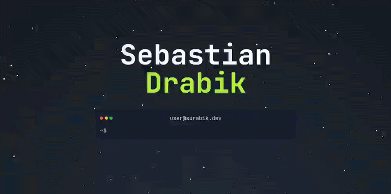

# Portfolio - https://srabik.dev/

To moja strona portfolio, na której prezentuję swoje projekty i umiejętności. Znajdziesz tutaj informacje o mojej edukacji, doświadczeniu zawodowym oraz kontakt do mnie. 

## Uruchomienie:
  - `git clone git@github.com:SebastianDrabik/portfolio.git`
  - Lokalnie: `npm i && npm run dev`
  - Production: `docker compose up -d`

## Production deploy:

Strona jest hostowana na VPS oracle cloud i dostępna pod adresem: https://srabik.dev/.
Domeną zarządza Cloudflare.

## Techstack strony:

- [Tanstack Start](https://tanstack.com/start/latest)
  - TypeScript
  - [tailwindcss]()
  - [Shadcn/ui](https://ui.shadcn.com/) - komponenty UI z wlasnym theme [tweakcn](https://tweakcn.com/)
- Docker

## Roadmap:
  - [x] Docker
  - [ ] Gwiazdki w tle sekcji Hero dynamicznie z p5js oraz ciekawy efekt(np. na podstawie commitow z GH) 
  - [ ] Animacje na stronie
  - [ ] Blog
  - [ ] Custom CI/CD pipeline
  - [ ] translacje en/pl (paraglidejs)
  - [ ] Sekcja z certyfikatami